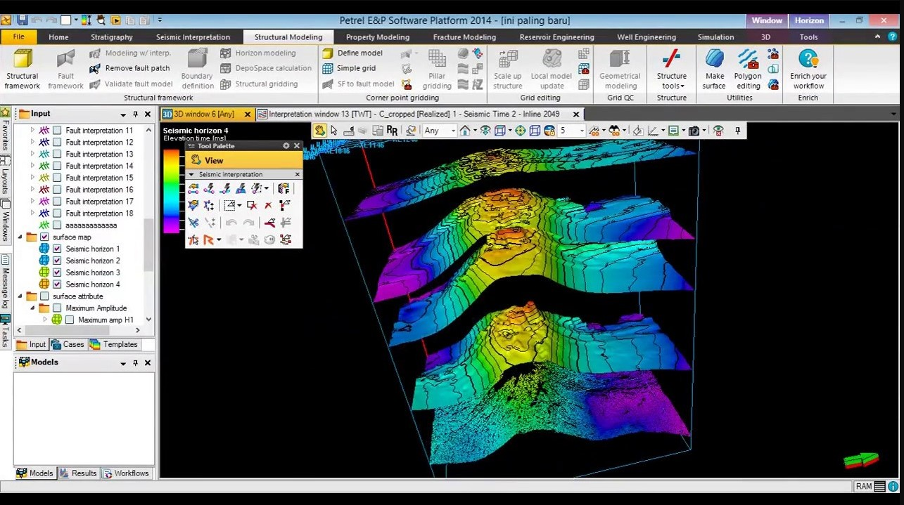
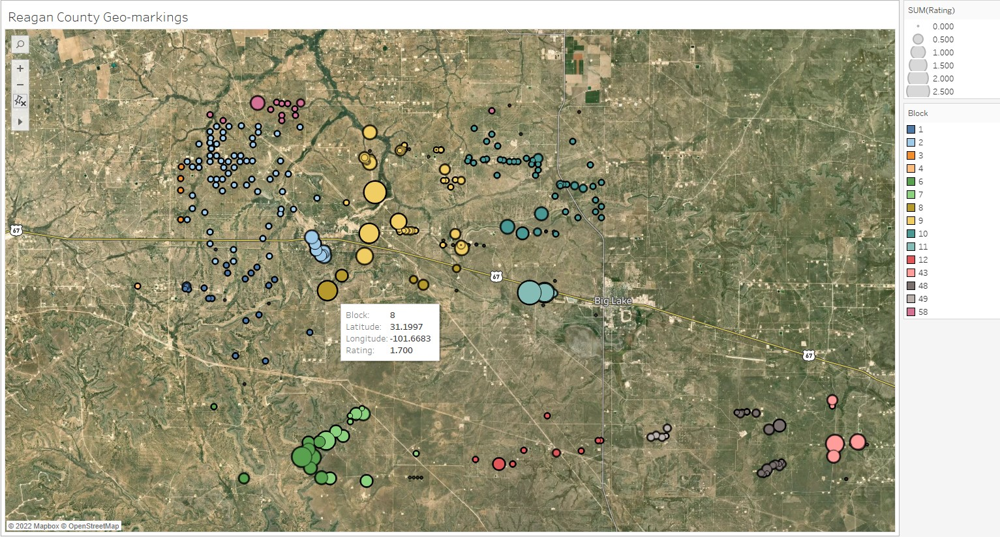
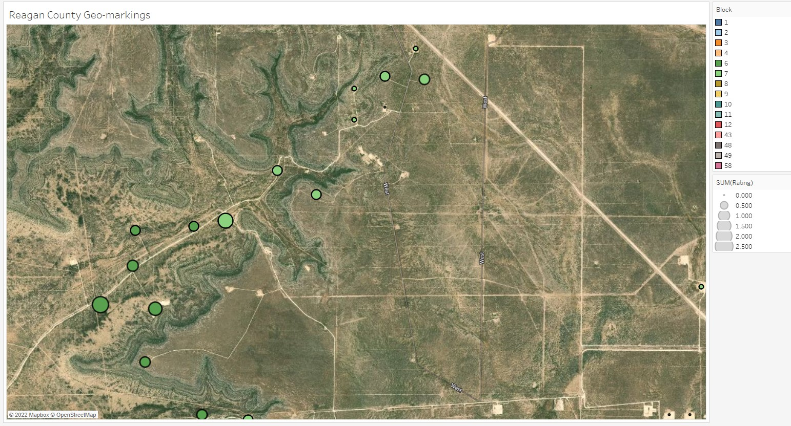
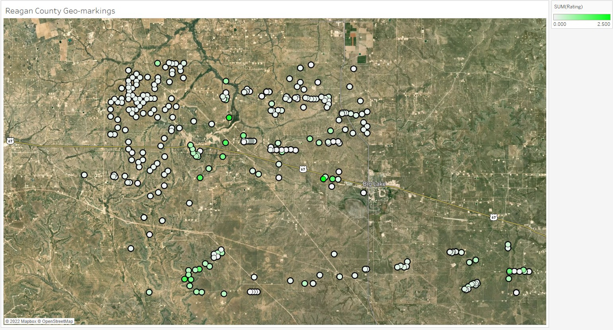
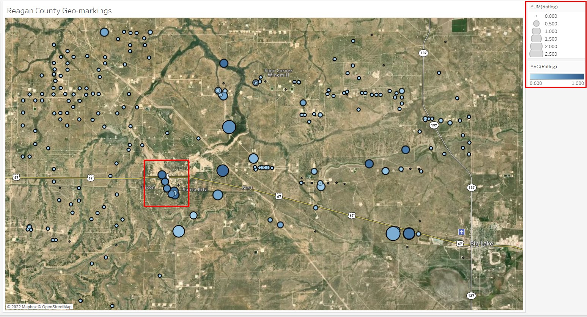
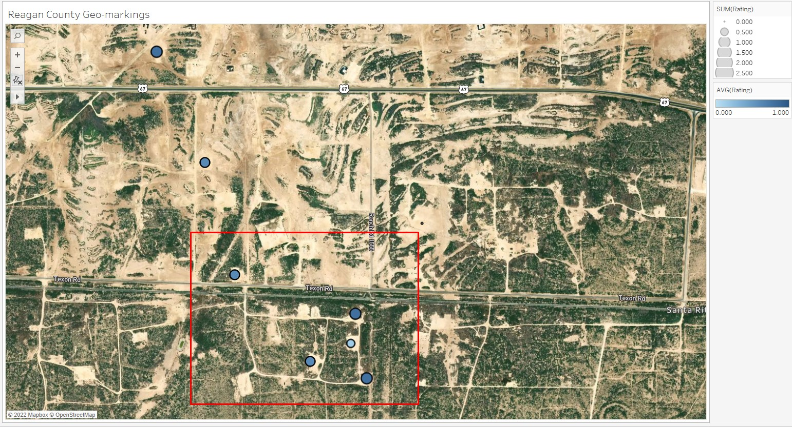

# PENG_Lab
## University of Texas Petroleum Engineering Dept. Research and Data Analytics

### Overview
The purpose of this repository is to serve as a first trial for an attempted FTP and web scrape of oil and gas well logs in Lasio format.

Schlumberger Petrel reservoir analysis software is a modern and effective way to visualize underground formations. For accurate representations, accurate data from multiple locations is required and the resultant gradients between locations can be interpolated using a variety of algorithms.

However, the web-based text-field search for individual public well logs in the area is cumbersome and not receptive to automation. For that reason, the University Lands repo of LAS Lasio well log files was downloaded and [Python scripts made to consolidate the information](LAS_Search_V2.2.ipynb). Because each well log is unique and carries different readings, they were subjectively reduced to a count, with the quality of a well log determined by the number of tools used to capture data, normalized to max and min tools (1 and 0).

These well logs contained an API number which was then used to scrape the Univerisity Lands database for latitude and longitude [here.](Scraping The Wells - Successful.ipynb) While better formatting would have been nice, [it did the job.](Macro_enabled_full_list.xlsm).

This information was brought into Tableau into this workbook: [Reagan Map](Reagan_Map.twb). The same can be accomplished for the other sections (but thus far has not)

### Results

This method provides a useful and striking visual overview of the geographic region, indicating block number and whole amount of readings per data point.

It was successful in mapping geographic locations to the well's reported locations:

Tableau allowed for various methods of applying visual properties to well log data ratings, including means and counts

